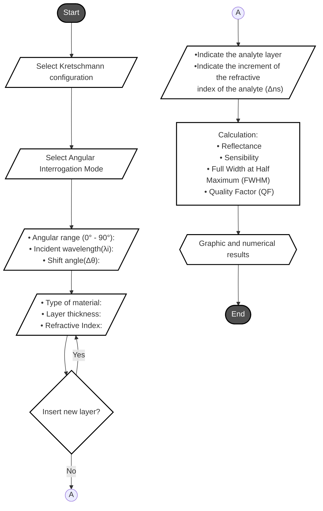

# **Sim- LMR** 

### **Description**

> In this initial release, the _**Sim-LMR**_ gives support for to calculate the **Resonant Angle**, **the Angular Sensibility**, **the Full Width at Half Maximum** and the **Quality Factor** on **Angular Interrogation Mode** considering **Krestchmann configuration**. 

> The numerical model is based on the attenuated total reflection method combined with the transfer matrix method for a multilayer system. 

> At the end of the simulation, the code provides results in terms of:

- Resonance Angle in TM and TE Polarization,
- Angular Sensibility in TM and TE Polarization,
- Full Width at Half Maximum in TM and TE Polarization,
- Variation of the Resonance Angle and
- Quality Factor.

> And even graphical responses with: 

- Reflectance vs. Angle of Incidence,
- Reflectance vs. Angle of Incidence Given the Variation of the Refractive Index of the Analyte, 
- Angular Sensibility vs. Refractive Index of the Analyte, 
- Resonance Angle vs. Refractive Index of the Analyte,
- Full Width at Half Maximum vs. Refractive Index of the Analyte and
- Quality Factor vs. Refractive Index of the Analyte.

> The results obtained were validated using scenarios available in the literature.

> Even being a software under development, the Sim-LMR presents itself as an original and promising open source platform for advances and collaborations in the area of ​​optical sensor research.

### Other Features

- [x] Open source;
- [x] Python language;
- [x] Supports N layers;
- [x] Kretschmann-Raether configuration;
- [x] Angular Interrogation Mode;
- [x] It uses lines of code;
- [x] Python 3.5 or higher;
- [x] Python Libraries: Numpy, Matplotlib, OS, Sys and Time;

### **Flowchart**

### Contacts

> **Adeilson de Sousa Leal** -  Electrical Engineering Department - Federal University of Campina Grande - UFCG
-  **Email:** adeilson.leal@ee.ufcg.edu.br
- **LinkedIn:** https://www.linkedin.com/in/adeilson-de-sousa-leal-8a04271a1/

> **Helder Alves Pereira** -  Electrical Engineering Department - Federal University of Campina Grande - UFCG
- **Email:** helder.pereira@dee.ufcg.edu.br

